# Daily Digest Agent

Local-first AI Agent chạy trên Apple Silicon để:
- thu thập tin AI/Tech từ nhiều nguồn
- chấm điểm và lọc bài đáng chú ý
- lưu Notion
- tạo brief Telegram chính

Mặc định hệ ưu tiên local inference qua MLX, không cần API inference để chạy hằng ngày.

## Features

| Feature | Mô tả |
|---|---|
| Multi-source gathering | Curated RSS + official blogs + GitHub + watchlist + DDG bổ sung + HN + Reddit + Telegram channels |
| 3-lane classification | Product · Society & Culture · Practical |
| Local LLM inference | MLX trên Apple Silicon với Qwen2.5-32B-Instruct-4bit + fallback 14B |
| Optional Grok reranker | Nếu có `XAI_API_KEY`, Grok rerank shortlist để chọn bài nào đáng lên main brief |
| Notion archiving | Tạo hoặc reuse page theo URL nguồn để giảm duplicate |
| Telegram delivery | Brief chính vào `TELEGRAM_THREAD_ID` |
| Weekly executive memo | Có script dựng memo tuần từ SQLite history để nhìn signal, theme và action item |
| Watchlist intelligence | Dựng báo cáo strategic watchlist + topic artifacts từ local history và watchlist seeds |
| Topic pages | Có thể tạo artifact markdown cho từng topic, và sync lên Notion nếu cấu hình `NOTION_TOPIC_DATABASE_ID` |
| Reviewability | Có run report markdown để kiểm tra nguồn, score, candidates và quality gate |
| Run health | Mỗi run có `health_status` + `publish_ready` để biết batch nào nên publish thật |
| Eval harness | Có script regression `scripts/eval_digest.py` để đo type/tier/delivery trên bộ case cố định |
| Preview workflow | Chạy preview trong UI rồi `Approve Preview` để publish đúng batch preview đó |
| Temporal snapshots | Mỗi run có JSON snapshot sau gather và sau scoring để debug source mix / shortlist dễ hơn |
| Source history | Mỗi publish run học dần nguồn nào hay ra bài tốt, nguồn nào hay ra stale/promo/speculation để giảm noise ở các run sau |

## Architecture

Pipeline hiện tại dùng một `LangGraph StateGraph` duy nhất cho cả preview và publish. Flow thực tế trong code là:

```text
gather
→ normalize_source
→ deduplicate
→ collect_feedback
→ early_rule_filter
→ batch_classify_and_score
→ batch_deep_process / batch_quick_compose
→ merge_processed_articles
→ delivery_judge
→ save_notion
→ summarize_vn
→ quality_gate
→ send_telegram
→ generate_run_report
→ END
```

Khác biệt quan trọng so với flow cũ:

- classify và deep processing đã chuyển sang `batch nodes`
- `merge_processed_articles` là điểm hợp nhất fan-out trước delivery
- preview và publish dùng cùng backbone logic
- `Approve Preview` publish từ đúng `preview_state`, không regather lại từ đầu
- delivery chính thức hiện là `main Telegram brief`, không còn GitHub/Facebook lane như đường publish độc lập trong flow chính

Sơ đồ và tài liệu chi tiết:

- [Architecture diagrams](docs/architecture_diagrams.md)
- [Cấu Trúc Hệ Thống](docs/digest_system_structure.md)
- [Map Process Theo Scrum](docs/digest_scrum_process.md)
- Render lại asset ảnh: `./scripts/export_architecture_diagrams.sh`



Pipeline xuất ra 1 output Telegram chính:
- `telegram_messages`: brief công nghệ/AI chính

## Cài đặt

### 1. Tạo virtualenv

```bash
cd /Users/quangdang/Projects/AI-digest-v2
python3 -m venv .venv
source .venv/bin/activate
pip install -r requirements.txt
```

### 2. Cấu hình `.env`

```bash
cp config/.env.example config/.env
```

Điền các biến chính:
- `NOTION_TOKEN`
- `NOTION_DATABASE_ID`
- `NOTION_TOPIC_DATABASE_ID` nếu muốn sync topic pages/watchlist intelligence lên Notion riêng
- `TELEGRAM_BOT_TOKEN`
- `TELEGRAM_CHAT_ID`
- `TELEGRAM_THREAD_ID`
Optional:
- `TELETHON_API_ID`
- `TELETHON_API_HASH`
- `TELETHON_SESSION_NAME`
- `XAI_API_KEY`
- `GROK_DELIVERY_MODEL`
- `ENABLE_SOCIAL_SIGNALS`
- `ENABLE_FACEBOOK_AUTO`
- `FACEBOOK_AUTO_TARGETS_FILE`
- `FACEBOOK_CHROME_PROFILE_DIR`
- `FACEBOOK_STORAGE_STATE_FILE`
- `TEMPORAL_SNAPSHOTS_ENABLED`
- `TEMPORAL_SNAPSHOT_DIR`
- `DIGEST_ARTIFACT_CLEANUP_ENABLED`
- `DIGEST_ARTIFACT_ARCHIVE_DIR`

Nếu muốn bật lane nguồn Telegram qua Telethon:
- Lấy `TELETHON_API_ID` và `TELETHON_API_HASH` ở `https://my.telegram.org`
- Giữ `TELETHON_SESSION_NAME=digest_session`
- Chạy app một lần và hoàn tất bước login Telegram để tạo file `digest_session.session`
- Sau đó các channel như `aivietnam`, `MLVietnam`, `nghienai` mới thực sự active thay vì bị skip

Nếu muốn bật Reddit community signals qua PRAW:
- Điền `REDDIT_CLIENT_ID`, `REDDIT_CLIENT_SECRET`, `REDDIT_USER_AGENT`
- Nếu để trống, hệ vẫn fallback sang public Reddit JSON endpoint nhưng sẽ ít ổn định hơn

Nếu còn dùng Facebook auto như nguồn phụ:
- Session file ở `FACEBOOK_STORAGE_STATE_FILE` sẽ bị coi là stale khi cũ hơn 7 ngày
- Pipeline sẽ alert Telegram: `⚠️ Facebook session cũ hơn 7 ngày. Cần chạy scripts/facebook_login_setup.py`
- Refresh bằng `PYTHONDONTWRITEBYTECODE=1 .venv/bin/python scripts/facebook_login_setup.py`

## Chạy

### Chạy publish thật

```bash
source .venv/bin/activate
PYTHONDONTWRITEBYTECODE=1 .venv/bin/python main.py
```

### Chạy UI local

```bash
source .venv/bin/activate
PYTHONDONTWRITEBYTECODE=1 .venv/bin/python ui_server.py
```

Mặc định UI ở:

```text
http://127.0.0.1:8787
```

Có thể đổi bằng:

```env
DIGEST_UI_HOST=127.0.0.1
DIGEST_UI_PORT=8787
```

### Dựng weekly memo

```bash
source .venv/bin/activate
PYTHONDONTWRITEBYTECODE=1 .venv/bin/python scripts/weekly_memo.py --write
```

### Dựng watchlist intelligence

```bash
source .venv/bin/activate
PYTHONDONTWRITEBYTECODE=1 .venv/bin/python scripts/watchlist_intelligence.py --write
```

Script này sẽ tạo:
- `reports/watchlist_intelligence_YYYY-MM-DD.md`
- `reports/topics_YYYY-MM-DD/*.md`

Flow khuyên dùng:
- `Run Preview (Production)`: chạy full reasoning nhưng chưa publish, bám sát logic production
- `Run Preview (Grok Smart)`: chạy cùng backbone hiện tại nhưng mở rộng lớp Grok để so chất lượng output
- UI chỉ để xem trước output main brief hiện tại, không còn chỗ chỉnh threshold/source toggle
- review kết quả trong UI
- `Approve Preview`: publish đúng batch preview đó, không regather lại từ đầu

Chạy publish profile `grok_smart` từ terminal:

```bash
cd /Users/quangdang/Projects/AI-digest-v2
source .venv/bin/activate
DIGEST_RUN_PROFILE=grok_smart PYTHONDONTWRITEBYTECODE=1 .venv/bin/python main.py
```

### Chạy eval regression

```bash
source .venv/bin/activate
PYTHONDONTWRITEBYTECODE=1 .venv/bin/python scripts/eval_digest.py --write-report
```

Script này sẽ đọc [config/prompt_tuning_cases.jsonl](config/prompt_tuning_cases.jsonl), chấm deterministic regression cho type/tier/delivery, rồi ghi report markdown vào `reports/`.

### Bật Grok để chọn bài lên brief thông minh hơn

Nếu bạn có xAI API key, chỉ cần thêm vào `config/.env`:

```env
XAI_API_KEY=...
GROK_DELIVERY_JUDGE_ENABLED=1
GROK_DELIVERY_MODEL=grok-4-1-fast-non-reasoning
```

Hệ sẽ giữ gather + scoring local như cũ, nhưng ở bước `delivery_judge` sẽ gửi một shortlist nhỏ lên Grok để:
- rerank bài nào đáng lên main Telegram brief
- siết bớt repo/tool noise
- ưu tiên bài founder-grade, mới, có giá trị vận hành
- tham chiếu feedback gần đây của team khi chọn shortlist cuối

Để giới hạn chi phí, Grok chỉ được gọi cho shortlist cuối, không chạy trên toàn bộ batch.

## Auto schedule

```bash
cp scripts/launchd.plist ~/Library/LaunchAgents/com.quangdang.daily-digest-agent.plist
launchctl load ~/Library/LaunchAgents/com.quangdang.daily-digest-agent.plist
```

Kiểm tra:

```bash
launchctl list | grep digest
```

Gỡ:

```bash
launchctl unload ~/Library/LaunchAgents/com.quangdang.daily-digest-agent.plist
```

## Project Structure

```text
AI-digest-v2/
├── main.py
├── pipeline_runner.py
├── ui_server.py
├── graph.py
├── requirements.txt
├── config/
│   ├── .env.example
│   ├── prompt_daily_digest.md
│   ├── output_templates.md
│   └── watchlist_seeds.txt
├── digest/
│   ├── editorial/
│   ├── runtime/
│   ├── sources/
│   │   └── adapters/
│   ├── storage/
│   └── workflow/
│       ├── graph.py
│       └── nodes/
│           ├── gather_news.py
│           ├── normalize_source.py
│           ├── deduplicate.py
│           ├── collect_feedback.py
│           ├── early_rule_filter_node.py
│           ├── batch_classify_and_score_node.py
│           ├── batch_deep_process_node.py
│           ├── batch_quick_compose_node.py
│           ├── classify_and_score.py
│           ├── deep_analysis.py
│           ├── recommend_idea.py
│           ├── compose_note_summary.py
│           ├── delivery_judge.py
│           ├── save_notion.py
│           ├── summarize_vn.py
│           ├── quality_gate.py
│           ├── send_telegram.py
│           └── generate_run_report.py
├── docs/
│   ├── archive/
│   ├── planning/
│   ├── architecture_diagrams.md
│   ├── digest_system_structure.md
│   ├── digest_scrum_process.md
│   └── assets/
│       ├── system_overview.svg
│       └── execution_flow.svg
├── scripts/
│   ├── add_social_signal.py
│   ├── eval_digest.py
│   ├── export_architecture_diagrams.sh
│   ├── facebook_login_setup.py
│   ├── github_agent_brief.py
│   ├── launchd.plist
│   ├── setup_scheduler.sh
│   ├── source_health_check.py
│   ├── watchlist_intelligence.py
│   └── weekly_memo.py
├── tests/
│   ├── test_editorial_guardrails.py
│   └── test_mvp3_speed_optimized.py
├── reports/
└── README.md
```

Support modules giờ nằm dưới `digest/` theo 5 lớp: `editorial`, `runtime`, `sources`, `storage`, `workflow`. Workflow graph thực nằm ở `digest/workflow/graph.py`, toàn bộ node implementations nằm ở `digest/workflow/nodes/`, còn `graph.py` ở root chỉ giữ compatibility facade cho entry points cũ.

## Debug

```bash
# Kiểm tra logs
cat digest.log
cat digest_error.log

# Chạy publish với log ra file
PYTHONDONTWRITEBYTECODE=1 .venv/bin/python main.py 2>&1 | tee debug_output.txt

# Chạy UI local
PYTHONDONTWRITEBYTECODE=1 .venv/bin/python ui_server.py

# Kiểm tra database
python -c "from digest.storage.db import get_history; print(len(get_history()))"

# Xem RAM đang dùng trên Mac
top -l 1 | grep PhysMem

# Chạy eval và ghi report
PYTHONDONTWRITEBYTECODE=1 .venv/bin/python scripts/eval_digest.py --write-report
```

## Artifact Retention

Runtime artifacts không còn nên nằm lẫn trong git history. Mỗi run giờ sẽ tự dọn theo rule an toàn:
- `reports/daily_digest_run_*.md`: giữ tối đa 12 file gần nhất và không quá 7 ngày trong working tree
- `reports/eval_digest_*.md`: giữ tối đa 6 file gần nhất và không quá 14 ngày
- `reports/github_agent_brief_*.md`: giữ tối đa 6 file gần nhất và không quá 14 ngày
- `reports/temporal_snapshots/*.json`: giữ tối đa 8 file gần nhất và không quá 3 ngày
- `.checkpoints/*.tar.gz`: giữ tối đa 2 file gần nhất và không quá 21 ngày
- `debug_output.txt` và log tạm ở root: nếu cũ hơn 12 giờ sẽ được archive

Các file cũ không bị xóa thẳng khỏi máy. Chúng được chuyển sang `.runtime_archive/` để bạn vẫn có thể tra cứu khi cần, còn git working tree thì gọn hơn hẳn.

## Tùy chỉnh

- Thêm watchlist sếp/team trong `config/watchlist_seeds.txt`
- Có thể thêm strategic buckets trong watchlist:
  - `company:OpenAI`
  - `product:GPT-4.1`
  - `tool:LangGraph`
  - `policy:EU AI Act`
  - `topic:Claude Code`
- Chỉnh nguồn và query trong `digest/sources/source_registry.py`
- Đổi model trong `config/.env`
- Đổi prompt trong `config/prompt_daily_digest.md`
- Đổi giờ chạy trong `scripts/launchd.plist`
- Nếu vẫn muốn thử nguồn Facebook/social thủ công cho mục đích nghiên cứu, xem `config/facebook_auto_targets.txt` và `scripts/facebook_login_setup.py`, nhưng lane Facebook riêng không còn là đường delivery chính thức
