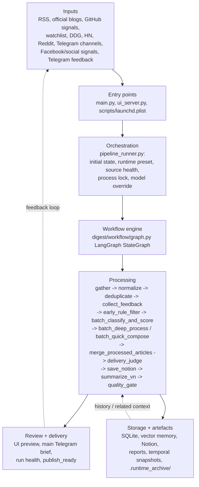
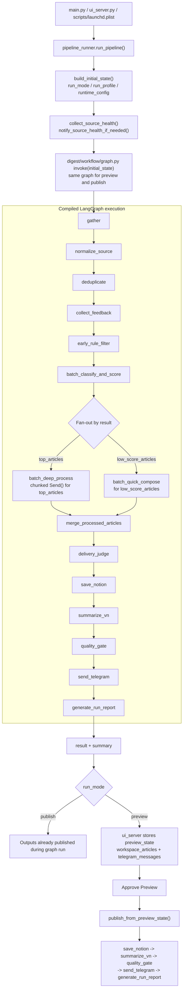

# Daily Digest Architecture Diagrams

File này giữ `Mermaid source of truth` cho 2 sơ đồ kiến trúc chính của dự án. Khi cần render lại asset ảnh, dùng `scripts/export_architecture_diagrams.sh`.

## 1. System Overview

<!-- diagram: system_overview -->

## 2. Execution Flow

<!-- diagram: execution_flow -->

