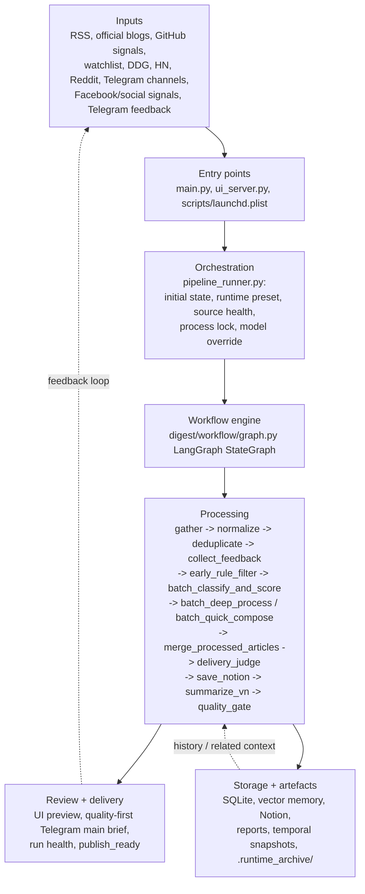
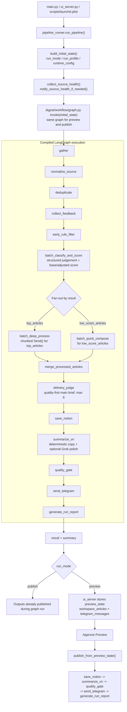

# Daily Digest Architecture Diagrams

File này giữ `Mermaid source of truth` cho 2 sơ đồ kiến trúc chính của dự án. Khi cần render lại asset ảnh, dùng `scripts/export_architecture_diagrams.sh`.

## 1. System Overview

<!-- diagram: system_overview -->

## 2. Execution Flow

<!-- diagram: execution_flow -->

## 3. Simplified System Flow (VN)

Sơ đồ này dùng cho PM, sếp hoặc stakeholder không đi sâu vào code.
Nó ưu tiên mô tả `hệ thống làm gì` hơn là `file nào chạy`.

```mermaid
flowchart LR
  subgraph I["Input"]
    I1["Nguồn tin chính thức<br/>RSS, blog, hãng AI, media mạnh"]
    I2["Nguồn cộng đồng<br/>GitHub, Reddit, HN, Telegram, Facebook"]
    I3["Nguồn mở rộng<br/>watchlist, search bổ sung"]
    I4["Phản hồi từ team<br/>Telegram feedback"]
  end

  subgraph C["Thu thập và làm sạch"]
    C0["Kích hoạt chạy<br/>lịch tự động hoặc preview thủ công"]
    C1["Thu thập bài viết từ nhiều nguồn"]
    C2["Chuẩn hóa metadata nguồn"]
    C3["Loại bài trùng / bài cũ / bài yếu"]
    C4["Nạp phản hồi gần đây để chỉnh gu chọn tin"]
  end

  subgraph P["Đánh giá và phân tích"]
    P1["Phân loại chủ đề, tạo structured judgement,<br/>và chấm điểm gốc"]
    P2{"Mức độ ưu tiên"}
    P3["Tin mạnh:<br/>phân tích sâu, góc nhìn, khuyến nghị"]
    P4["Tin phụ:<br/>tóm tắt nhanh để lưu và theo dõi"]
    P5["Hợp nhất bài đã xử lý<br/>và giữ base score / adjustments rõ ràng"]
  end

  subgraph R["Kiểm duyệt + xuất bản"]
    R1["Chọn main brief quality-first<br/>tối đa 6 tin, ưu tiên official/media mạnh"]
    R2["Lưu vào kho tri thức Notion"]
    R3["Dựng copy Telegram từ structured fields<br/>deterministic fallback, Grok chỉ polish khi bật"]
    R4["Gửi bản tin Telegram"]
    R5["Tạo báo cáo vận hành sau mỗi run"]
  end

  subgraph O["Output"]
    O1["Daily Telegram brief<br/>bản tin chính cho team"]
    O2["Notion knowledge base<br/>bài đã lưu + topic pages"]
    O3["Preview để duyệt trước khi publish"]
    O4["Run health / publish readiness<br/>team biết batch có ổn không"]
    O5["Báo cáo chiến lược<br/>weekly memo, watchlist, snapshots"]
  end

  I1 --> C0
  I2 --> C0
  I3 --> C0
  C0 --> C1 --> C2 --> C3 --> C4
  I4 -. học từ phản hồi .-> C4

  C4 --> P1 --> P2
  P2 --> P3
  P2 --> P4
  P3 --> P5
  P4 --> P5

  P5 --> R1 --> R2 --> R3 --> R4 --> R5

  R4 --> O1
  R2 --> O2
  R3 -. preview trước khi gửi .-> O3
  R5 --> O4
  R5 --> O5
```

<!-- diagram: simplified_system_flow_vi -->

Ghi chú nghiệp vụ:
- `Preview` và `publish` dùng cùng logic chọn tin.
- Khi `Approve Preview`, hệ sẽ publish đúng batch đã duyệt, không chạy lại từ đầu.
- Telegram là đầu ra chính; Notion là kho lưu trữ và tra cứu; báo cáo là lớp quản trị chất lượng run.
- `Classification` tạo structured judgement; copy Telegram được dựng ở bước sau với deterministic fallback.
- `Grok` là lớp polish/rerank tùy chọn, không phải writer bắt buộc của hệ thống.
- `Main brief` là shortlist chất lượng cao, không phải cố lấp đầy đủ lane; `GitHub` chỉ nên vào brief chính khi có tác động ecosystem/adoption rõ.
- Run report cần được đọc theo `base score + adjustments + adjusted score`, không giả định `c1/c2/c3` luôn bằng điểm hiển thị cuối.
