# Daily Digest Process Map Theo Khung Scrum

Tài liệu này mô tả `quy trình vận hành thực tế` của dự án Daily Digest Agent theo ngôn ngữ Scrum để dễ trao đổi với quản lý, Product Owner và team kỹ thuật. Mục tiêu không phải mô tả Scrum lý thuyết, mà là ánh xạ đúng những gì hệ thống hiện đang làm trong code.

## 1. Mục tiêu của quy trình

Hệ thống này được xây để mỗi ngày tạo ra một batch tin AI/Tech đã qua:

- thu thập từ nhiều nguồn
- chuẩn hóa và lọc nhiễu
- chấm điểm và chọn bài đáng quan tâm
- lưu vào Notion làm knowledge base
- dựng main Telegram brief và artefact review cho batch
- tạo run report để review và học dần từ feedback

Nói ngắn gọn, đây là một `editorial delivery system` có quy trình vận hành hằng ngày, không chỉ là một script crawl tin.

## 2. Vai trò trong quy trình

### Product Owner / Sếp

Đóng vai trò quyết định mục tiêu nghiệp vụ:

- muốn brief phục vụ ai
- loại tin nào đáng ưu tiên
- nguồn tín hiệu nào cần ưu tiên hơn trong main brief
- batch nào đủ tốt để publish thật
- feedback nào sẽ quay lại backlog

Trong hệ thống hiện tại, các quyết định này được phản ánh qua:

- `runtime preset`
- watchlist, GitHub seeds, Facebook targets
- feedback team trên Telegram
- review run report và preview UI

### Team / AI Digest Pipeline

Đây là phần thực thi chính của hệ thống:

- `gather`
- `normalize_source`
- `deduplicate`
- `collect_feedback`
- `early_rule_filter`
- `batch_classify_and_score`
- `batch_deep_process`
- `batch_quick_compose`
- `merge_processed_articles`
- `delivery_judge`
- `save_notion`
- `summarize_vn`
- `quality_gate`
- `send_telegram`
- `generate_run_report`

Tức là vai trò “team” ở đây không chỉ là con người, mà là cả tổ hợp code + node + data flow đang chạy mỗi ngày.

### Scrum Master / Người giữ nhịp hệ thống

Vai trò này thiên về bảo đảm run ổn định và gỡ block kỹ thuật:

- giữ scheduler chạy đúng giờ qua `launchd`
- kiểm tra `run health`
- xem snapshot, log, report khi batch có vấn đề
- giữ artifact gọn bằng retention/archive
- bảo đảm preview và publish không chạy chồng nhau bằng pipeline lock

## 3. Bức tranh quy trình tổng thể

```mermaid
flowchart TB
  subgraph Backlog["Product Backlog / Operational Backlog"]
    B1["Nguồn tin cốt lõi\nRSS, official blogs, GitHub seeds"]
    B2["Nguồn cộng đồng\nReddit, HN, Telegram, Facebook targets"]
    B3["Feedback vận hành\nstale, weak source, wrong type, founder lens"]
    B4["Cải tiến kỹ thuật\nthreshold, dedup, preset, health rules"]
  end

  subgraph Planning["Sprint Planning / Run Planning"]
    P1["Chọn kiểu run\npreview hoặc publish"]
    P2["Chọn profile\npublish / fast / grok_smart"]
    P3["Chốt phạm vi batch\nnguồn, cap article, Grok flags, social flags"]
  end

  subgraph Execution["Sprint Execution - 1 batch digest"]
    E1["Gather đa nguồn"]
    E2["Normalize + verify nguồn + published_at"]
    E3["Dedup + recall lịch sử"]
    E4["Sync feedback từ Telegram"]
    E5["Rule prefilter + batch classify + chia top/low"]
    E6["Batch deep process cho top<br/>quick compose cho low"]
    E7["Merge + delivery judge"]
    E8["Save Notion + summarize + quality gate + send"]
  end

  subgraph Review["Review / Approve"]
    R1["UI preview\nworkspace articles + main brief"]
    R2["Run report + health + snapshots"]
    R3["Approve preview hoặc giữ lại review"]
  end

  subgraph Done["Increment / Done"]
    D1["Telegram published"]
    D2["Notion pages"]
    D3["Source history updated"]
    D4["Bài học quay lại backlog"]
  end

  Backlog --> Planning
  Planning --> Execution
  Execution --> Review
  Review --> Done
  Done -.-> Backlog
```



## 4. Sprint của hệ này thực chất là gì

Trong Daily Digest Agent, `sprint` không phải sprint 1-2 tuần theo nghĩa phát triển phần mềm thuần. Nó giống một `vòng chạy digest` lặp lại, thường là 1 ngày / 1 batch.

Một sprint thực tế gồm:

1. chuẩn bị input và mục tiêu của batch
2. chạy pipeline preview hoặc publish
3. review output và artefact
4. approve hoặc hold
5. ghi nhận bài học cho lần chạy tiếp theo

Vì vậy ảnh Scrum sếp gửi có thể hiểu theo cách này:

- vòng lặp lớn là `chu kỳ digest`
- daily stand-up tương ứng với `kiểm tra nhanh tình trạng hệ`
- sprint review tương ứng với `review preview/report`
- retrospective tương ứng với `điều chỉnh source/preset/guardrail`

## 5. Chi tiết từng giai đoạn của quy trình

### 5.1. Backlog

Backlog của hệ thống này không chỉ là ticket dev. Nó gồm 4 nhóm:

- `Nguồn dữ liệu`: RSS feeds, official blogs, GitHub repos/orgs/query, watchlist, Telegram channels, Reddit, Hacker News, Facebook targets
- `Luật chọn tin`: source tier, source kind, blocked domains, scoring threshold, delivery heuristics
- `Feedback vận hành`: team phản hồi trực tiếp trên Telegram như `cũ`, `nguồn yếu`, `không liên quan`, `nên lên brief`
- `Debt kỹ thuật`: Facebook scrape, stale detection, dedup event, quality gate, artifact cleanup

Input backlog hiện nằm rải ở:

- `digest/sources/source_registry.py`
- `digest/sources/source_policy.py`
- `digest/sources/source_runtime.py`
- `config/watchlist_seeds.txt`
- `config/facebook_auto_targets.txt`
- `digest/editorial/feedback_loop.py`
- `digest/runtime/runtime_presets.py`

### 5.2. Planning

Planning của một batch chính là quyết định `run configuration`.

Hiện tại hệ thống đang có các lựa chọn chính:

- `run_mode=preview`: chạy full reasoning nhưng không publish ra ngoài
- `run_mode=publish`: chạy production thật
- `run_profile=publish`: cấu hình mặc định
- `run_profile=fast`: preview nhanh để review format/chọn tin
- `run_profile=grok_smart`: mở rộng Grok cho shortlist, judge, news copy, source gap

Planning còn bao gồm các quyết định như:

- có bật sync feedback không
- có bật social signals và Facebook auto không
- số lượng article tối đa cho classify / deep analysis
- model MLX runtime nào đang dùng

Phần này nằm chủ yếu trong:

- `pipeline_runner.py`
- `digest/runtime/runtime_presets.py`
- `main.py`
- `ui_server.py`

### 5.3. Daily Stand-up / Health Check

Tương đương với bước kiểm tra nhanh trước hoặc sau run:

- nguồn có gather được không
- Facebook session còn sống không
- Telegram credential có đầy đủ không
- batch có bị GitHub noise lấn át không
- main brief có candidate đủ mạnh không
- summary có warning không

Hệ thống đang có health model deterministic trong `digest/runtime/run_health.py` để trả lời:

- batch này `green / yellow / red`
- có `publish_ready` hay không
- lý do vì sao chưa nên publish

### 5.4. Execution

Đây là “thân sprint” của hệ thống. Pipeline chạy theo thứ tự:

```text
gather
→ normalize_source
→ deduplicate
→ collect_feedback
→ early_rule_filter
→ batch_classify_and_score
→ batch_deep_process / batch_quick_compose
→ merge_processed_articles
→ delivery_judge
→ save_notion
→ summarize_vn
→ quality_gate
→ send_telegram
→ generate_run_report
```

Ý nghĩa nghiệp vụ của từng cụm:

- `Gather`: lấy nguyên liệu đầu vào từ nhiều nguồn
- `Normalize`: chuẩn hóa source, domain, published_at
- `Dedup`: loại bài trùng URL và gắn context lịch sử tương tự
- `Collect feedback`: đưa phản hồi team vào context batch hiện tại
- `Classify + score`: chấm bài theo góc nhìn editorial/operator và tách top/low theo batch
- `Deep / quick compose`: bài top vào batch deep process, bài còn lại vào batch quick compose
- `Merge`: hợp nhất hai nhánh để tạo tập `final_articles`
- `Delivery judge`: quyết định bài nào đủ mạnh để lên main brief
- `Save + summarize + gate`: lưu Notion, dựng brief, kiểm lỗi
- `Send + report`: gửi Telegram và tạo báo cáo hậu kiểm

### 5.5. Review

Review không diễn ra trong code một cách trừu tượng, mà có artefact cụ thể:

- `UI preview` ở local control panel
- `telegram preview` theo đúng main brief/chunks sẽ gửi
- `run report markdown`
- `temporal snapshots`
- `run health`

Người review sẽ nhìn vào:

- batch có tin đủ mới không
- có bị lệch nguồn không
- main brief có đủ mạnh không
- main brief có đủ mạnh và không bị noise lấn át không
- summary có warning không

### 5.6. Approve / Publish

Điểm rất quan trọng của hệ thống hiện tại là:

- preview chạy để xem trước
- approve sẽ publish đúng `preview state`
- không regather/rescore lại từ đầu

Điều này giúp tránh tình huống:

- preview thấy một batch đẹp
- đến lúc publish thì hệ thống chạy lại và ra batch khác

Phần này nằm ở:

- `ui_server.py`
- `pipeline_runner.py`

### 5.7. Retrospective

Sau mỗi run, team có thể học lại từ:

- `feedback` từ Telegram
- `source_history`
- `run_report`
- `artifact/snapshot`

Những câu hỏi retro quan trọng:

- nguồn nào đang hay ra bài tốt
- nguồn nào nhiều noise
- batch có stale nhiều không
- source mix hoặc routing nào đang yếu
- rule nào cần siết hoặc nới
- preset nào phù hợp cho từng mục đích review/publish

## 6. Đầu vào và đầu ra của mỗi vòng chạy

### Đầu vào

- config `.env`
- source registry và source policy
- watchlist runtime
- feedback gần đây từ Telegram
- preset/profile đang chọn
- source history từ các run trước

### Đầu ra

- `Notion pages` cho từng bài
- `Telegram main brief`
- `telegram_messages`
- `run report markdown`
- `temporal snapshots`
- `source history` đã cập nhật

## 7. Các artefact quản trị mà sếp có thể quan tâm

Nếu cần “map process hệ thống”, đây là các artefact quan trọng nhất để minh họa quy trình đang được kiểm soát:

- `Preview UI`: nơi xem batch trước khi publish
- `Run report`: báo cáo tổng hợp source mix, candidate, health, skip reasons
- `Temporal snapshots`: ảnh chụp dữ liệu sau gather và sau scoring
- `Source history`: trí nhớ chất lượng nguồn theo thời gian
- `Feedback loop`: học từ phản hồi team chứ không chỉ từ code cứng
- `Artifact retention`: giữ repo gọn và vẫn còn lịch sử để audit

## 8. Mapping nhanh Scrum sang hệ thống này

| Scrum concept | Daily Digest hiện tại |
|---|---|
| Product Backlog | source registry, watchlist, targets, feedback, debt kỹ thuật |
| Sprint Planning | chọn `preview/publish`, chọn `profile`, chốt runtime flags |
| Sprint Backlog | batch config hiện tại trong `runtime_config` |
| Daily Stand-up | check `run_health`, source mix, session, credentials |
| Sprint Execution | pipeline LangGraph chạy qua các node |
| Sprint Review | review UI preview, Telegram draft, report, snapshot |
| Sprint Retrospective | sửa seed, rule, threshold, source policy, feedback labels |
| Increment / Done | Notion + Telegram + report + source history update |

## 9. Kết luận để trao đổi với sếp

Nếu sếp hỏi “map process hệ thống”, ý gần đúng với repo này là:

- mô tả `vòng đời của một batch digest`
- chỉ ra `ai quyết định gì`, `hệ thống làm gì`, `review ở đâu`, `publish khi nào`
- thể hiện được `feedback loop` và `continuous improvement`

Tức là sếp đang cần `quy trình vận hành hệ thống`, không chỉ là cấu trúc thư mục hay sơ đồ code.
