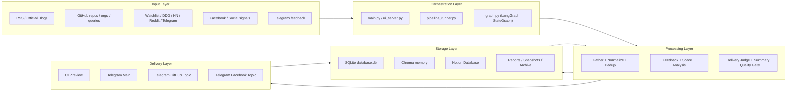
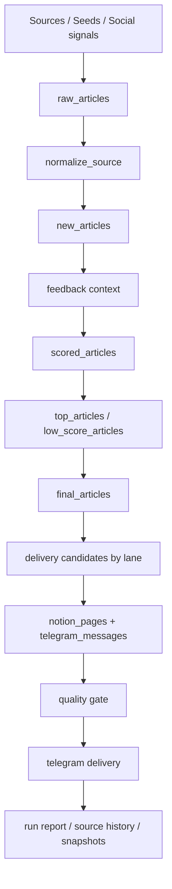

# Cấu Trúc Hệ Thống Daily Digest Agent

Tài liệu này mô tả `cấu trúc kỹ thuật hiện tại` của dự án Daily Digest Agent, bám theo code đang có trong repo. Nó dùng để giải thích hệ thống được tổ chức như thế nào, module nào chịu trách nhiệm gì, dữ liệu đi qua đâu và các điểm publish/review nằm ở đâu.

## 1. Mục tiêu hệ thống

Daily Digest Agent là một hệ thống `local-first AI editorial pipeline` chạy trên Apple Silicon để:

- thu thập tin AI/Tech từ nhiều nguồn
- lọc nhiễu và chuẩn hóa dữ liệu nguồn
- chấm điểm theo góc nhìn startup/operator
- tạo phân tích và summary tiếng Việt
- lưu kiến thức vào Notion
- gửi digest ra Telegram theo nhiều lane
- tích lũy feedback và lịch sử chất lượng nguồn để cải thiện dần

## 2. Góc nhìn kiến trúc cấp cao



## 3. Các lớp chính của hệ thống

### 3.1. Entry Points

Hệ thống có 3 điểm vào chính:

- `main.py`
  Chạy production flow từ terminal hoặc scheduler.
- `ui_server.py`
  Chạy local control panel để preview và approve.
- `github_agent_brief.py`
  Chạy lane GitHub riêng nếu cần thao tác độc lập.

Ngoài ra còn có:

- `launchd.plist`
  Scheduler để chạy hằng ngày lúc `08:00`.
- `pipeline_runner.py`
  Lõi điều phối dùng chung giữa CLI và UI.

### 3.2. Orchestration Layer

Đây là lớp điều phối vòng đời một run.

#### `main.py`

Nhiệm vụ:

- load `.env`
- khởi tạo logging
- đọc `DIGEST_RUN_PROFILE`
- gọi `run_pipeline(run_mode="publish")`
- in summary và log thống kê cuối run

#### `ui_server.py`

Nhiệm vụ:

- tạo local web UI
- cho chạy `preview`
- hiển thị preview articles và Telegram output
- cho phép `Approve Preview`
- publish đúng state đã preview, không regather lại

Điểm quan trọng về mặt hệ thống:

- UI không tự quyết logic editorial
- UI là lớp điều khiển và review
- pipeline thật vẫn nằm ở `pipeline_runner.py` + `graph.py`

#### `pipeline_runner.py`

Đây là lớp orchestration quan trọng nhất:

- build initial state
- áp runtime preset theo profile
- khóa liên tiến trình để chống chạy chồng
- compile / reuse graph
- chạy `preview` hoặc `publish`
- hỗ trợ publish trực tiếp từ preview state

Các cơ chế kỹ thuật đáng chú ý:

- `_pipeline_run_lock()`
  Khóa bằng file lock để UI, CLI và launchd không dẫm nhau.
- `_runtime_model_override()`
  Override model MLX theo profile/runtime nếu cần.
- `build_initial_state()`
  Tạo state chuẩn cho graph.
- `publish_from_preview_state()`
  Publish từ đúng batch đã review.

### 3.3. Workflow Engine

`graph.py` định nghĩa `LangGraph StateGraph` cho toàn bộ pipeline.

State trung tâm là `DigestState`, chứa các nhóm dữ liệu:

- cờ run: `run_mode`, `run_profile`, `publish_notion`, `publish_telegram`, `persist_local`
- dữ liệu thu thập: `raw_articles`
- dữ liệu sau làm sạch: `new_articles`
- feedback context
- kết quả scoring: `scored_articles`, `top_articles`, `low_score_articles`
- dữ liệu delivery: `final_articles`, `telegram_candidates`, `github_topic_candidates`, `facebook_topic_candidates`
- output publish: `notion_pages`, `telegram_messages`
- artefact quản trị: `run_report_path`, `run_health`, `publish_ready`, `snapshot paths`

Điểm rẽ nhánh chính:

- sau `classify_and_score`
- nếu có `top_articles` thì vào `deep_analysis`
- nếu không thì đi thẳng tới `compose_note_summary`

## 4. Pipeline xử lý chi tiết

### 4.1. Gather Layer

File chính:

- `nodes/gather_news.py`
- `source_registry.py`
- `source_policy.py`
- `source_runtime.py`
- `source_adapters/`

Nhiệm vụ:

- lấy dữ liệu từ nhiều nguồn
- gắn metadata acquisition/source kind
- bổ sung social/community signals
- ghi snapshot sau gather nếu bật

Các nhóm nguồn hiện có:

- `Official / RSS`
  OpenAI, Anthropic, Google, DeepMind, Meta, Hugging Face, Microsoft, Nvidia, AWS, Databricks, Cloudflare
- `Strong media`
  TechCrunch, The Verge, Ars Technica, MIT News
- `Vietnam media`
  GenK
- `GitHub signals`
  repo, org, release, search query
- `Community sources`
  Reddit, Hacker News, Telegram channels
- `Search supplements`
  DuckDuckGo query tiếng Anh và tiếng Việt
- `Watchlist runtime`
  file + env-based seeds
- `Facebook auto / social signals`
  target file, discovery cache, scraping adapter
- `Grok scout / X scout`
  lớp tăng cường nếu bật xAI

Các adapter đáng chú ý:

- `source_adapters/github_adapter.py`
- `source_adapters/facebook_adapter.py`
- `source_adapters/grok_scout_adapter.py`

### 4.2. Source Normalization Layer

File chính:

- `nodes/normalize_source.py`

Nhiệm vụ:

- trích `source_domain`
- phân loại `source_kind`
- chuẩn hóa `published_at`
- gắn `source_tier`
- loại bớt non-news candidate / off-topic signals ở mức nguồn

Tại sao lớp này quan trọng:

- scoring freshness phụ thuộc mạnh vào `published_at`
- delivery judge cần biết nguồn có đáng tin không
- report cần thống kê theo domain/source kind

### 4.3. Dedup + Memory Layer

File chính:

- `nodes/deduplicate.py`
- `db.py`
- `memory.py`

Dedup hiện chạy theo 2 tầng:

1. `SQLite URL hash`
   Loại các URL đã từng lưu.
2. `Vector memory recall`
   Tìm bài tương tự theo nội dung và gắn `related_past`.

Ngoài chuyện loại trùng, lớp này còn giúp:

- tránh lặp bản tin cũ
- giữ bối cảnh lịch sử cho phân tích sâu
- phát hiện bài mới nhưng thuộc cùng chủ đề với bài đã có

### 4.4. Feedback Layer

File chính:

- `nodes/collect_feedback.py`
- `feedback_loop.py`
- `db.py`

Nguồn feedback hiện là Telegram Bot API.

Hệ thống nhận các kiểu phản hồi như:

- `cũ`
- `nguồn yếu`
- `không liên quan`
- `đáng đọc`
- `đào sâu hơn`
- `ưu tiên founder`
- `không nên lên brief`
- `nên lên brief`
- `sai loại ...`

Feedback được dùng để tạo:

- `recent_feedback`
- `feedback_summary_text`
- `feedback_label_counts`

Điều này làm cho hệ thống có `human-in-the-loop memory`, không chỉ chạy theo rule tĩnh.

### 4.5. Editorial Scoring Layer

File chính:

- `nodes/classify_and_score.py`
- `editorial_guardrails.py`
- `mlx_runner.py`

Mục tiêu:

- classify 6 nhóm tin
- chấm điểm theo độ quan trọng với startup/operator
- quyết định bài nào cần deep analysis

6 nhóm tin hiện dùng:

- `Research`
- `Product`
- `Business`
- `Policy & Ethics`
- `Society & Culture`
- `Practical`

Kết quả đầu ra chính:

- `scored_articles`
- `top_articles`
- `low_score_articles`

Hệ cũng có thể bật `Grok prefilter` để rerank shortlist trước lớp scoring sâu hơn.

### 4.6. Deep Analysis Layer

File chính:

- `nodes/deep_analysis.py`
- `nodes/recommend_idea.py`
- `nodes/compose_note_summary.py`

Đây là lớp biến article thành editorial asset có thể dùng được.

#### `deep_analysis.py`

Chỉ chạy cho bài top score.

Nhiệm vụ:

- tìm thêm phản ứng cộng đồng bằng DDG
- đọc `related_past` từ memory
- viết `deep_analysis` / `content_page_md`
- buộc giữ các section evidence như fact anchors, inference, unknowns

#### `recommend_idea.py`

Tạo `recommend_idea` cho startup/product context của team.

#### `compose_note_summary.py`

Nén mỗi bài thành `note_summary_vi` để dùng cho:

- Notion property
- Telegram preview
- delivery judge context

### 4.7. Delivery Decision Layer

File chính:

- `nodes/delivery_judge.py`
- `digest_formatter.py`
- `xai_grok.py`

Đây là lớp quyết định `bài nào xứng đáng được gửi`.

Hệ thống hiện có 3 lane đầu ra:

- `telegram_candidates`
  main brief
- `github_topic_candidates`
  repo/release/tool lane riêng
- `facebook_topic_candidates`
  Facebook/social lane riêng

Logic judge gồm:

- deterministic heuristics
- freshness / stale check
- confidence / source tier check
- duplicate event suppression
- lane lock cho GitHub/Facebook
- optional Grok reranker/final editor

Đây là một lớp rất quan trọng, vì nó là ranh giới giữa:

- `article tốt để lưu`
- và `article đủ tốt để phát cho người dùng`

### 4.8. Persistence Layer

File chính:

- `nodes/save_notion.py`
- `db.py`
- `memory.py`
- `source_history.py`

#### SQLite (`database.db`)

Đang lưu các nhóm dữ liệu:

- `articles`
- `feedback_entries`
- `app_meta`
- `source_history`

Vai trò:

- dedup URL
- lưu article history
- lưu feedback history
- lưu offsets/meta
- lưu thống kê chất lượng nguồn theo thời gian

#### Chroma / vector memory

Vai trò:

- recall bài tương tự
- hỗ trợ historical context cho deep analysis

#### Notion

Mỗi article được lưu thành `1 page`.

Thông tin chính hiện được map gồm:

- title
- type
- url
- score
- summary
- recommend
- tags
- relevance/project fit
- analysis
- delivery decision
- source metadata
- freshness/confidence/source tier

#### Source History

Hệ thống học dần:

- nguồn nào hay ra bài mạnh
- nguồn nào nhiều stale/speculation/promo/weak
- bonus/penalty nên áp cho nguồn trong các run sau

### 4.9. Summary + Safety Layer

File chính:

- `nodes/summarize_vn.py`
- `nodes/quality_gate.py`
- `editorial_guardrails.py`

#### `summarize_vn.py`

Nhiệm vụ:

- dựng Telegram messages từ candidate đã qua judge
- giữ tách biệt 3 lane `main / GitHub / Facebook`
- có thể dùng history fallback khi batch mỏng
- optional Grok news copy để polish blurb

#### `quality_gate.py`

Nhiệm vụ:

- validate summary/messages trước khi gửi
- nếu có warning hoặc output rỗng thì fallback sang `safe digest`

Ý nghĩa:

- tránh hallucination hoặc summary lệch bài đã chọn
- đảm bảo “validate cùng tập bài sẽ gửi”

### 4.10. Delivery Layer

File chính:

- `nodes/send_telegram.py`

Đầu ra:

- main thread qua `TELEGRAM_THREAD_ID`
- GitHub topic qua `TELEGRAM_GITHUB_THREAD_ID`
- Facebook topic qua `TELEGRAM_FACEBOOK_THREAD_ID`

Đặc điểm:

- dùng Telegram Bot API
- hỗ trợ chia nhỏ message > 4096 chars
- preview mode sẽ không publish

### 4.11. Reporting + Artifact Layer

File chính:

- `nodes/generate_run_report.py`
- `run_health.py`
- `temporal_snapshots.py`
- `artifact_retention.py`

#### Run report

Tạo báo cáo markdown sau mỗi run với các nội dung:

- source mix
- scored/type/tag breakdown
- candidate breakdown theo lane
- delivery skip reasons
- feedback loop summary
- source history signals
- run health
- snapshot paths

#### Run health

Đánh giá batch theo:

- `green`
- `yellow`
- `red`

và quyết định `publish_ready`.

#### Temporal snapshots

Lưu JSON snapshot ổn định sau:

- gather
- scoring

để debug batch mà không cần mò log.

#### Artifact retention

Tự archive:

- reports cũ
- snapshots cũ
- checkpoints
- debug logs quá hạn

Mục tiêu là repo vẫn gọn nhưng còn khả năng audit.

## 5. Luồng dữ liệu thực tế



Các object dữ liệu quan trọng nhất trong state:

- `raw_articles`
  dữ liệu ngay sau gather
- `new_articles`
  dữ liệu sau normalize và dedup
- `scored_articles`
  dữ liệu đã classify + score
- `top_articles`
  bài đủ mạnh để deep analysis
- `final_articles`
  bài đã có note summary
- `telegram_candidates`
  bài đủ chuẩn để lên main brief
- `notion_pages`
  output persistence
- `telegram_messages`
  output delivery

## 6. Cấu trúc thư mục theo vai trò

```text
daily-digest-agent/
├── main.py                    # entry point publish
├── ui_server.py               # UI preview / approve
├── pipeline_runner.py         # orchestration layer
├── graph.py                   # LangGraph workflow
├── db.py                      # SQLite persistence
├── memory.py                  # vector memory
├── feedback_loop.py           # Telegram feedback ingestion
├── source_catalog.py          # facade cho source layer
├── source_registry.py         # seed sources / queries
├── source_policy.py           # trust policy / blocklist
├── source_runtime.py          # runtime seed loading
├── source_history.py          # source quality memory
├── runtime_presets.py         # profile overrides
├── run_health.py              # publish readiness
├── temporal_snapshots.py      # JSON batch snapshots
├── artifact_retention.py      # archive artifacts cũ
├── source_adapters/           # GitHub, Facebook, Grok scout adapters
├── nodes/                     # từng bước LangGraph
├── config/                    # env example, prompts, seeds, inbox
├── docs/                      # tài liệu vận hành và kiến trúc
└── launchd.plist              # macOS scheduler
```

## 7. Chế độ chạy hiện tại

### Publish mode

Mục tiêu:

- chạy thật
- có thể lưu local
- có thể lưu Notion
- có thể gửi Telegram

### Preview mode

Mục tiêu:

- chạy đủ reasoning để review
- không publish ra ngoài
- không pollute local persistence

### Runtime profiles

- `publish`
  cấu hình production chuẩn
- `fast`
  preview nhanh, ít nguồn chậm, deterministic note summary
- `grok_smart`
  mở rộng Grok cho judge/copy/source gap/social scout

## 8. Các điểm mạnh hiện có của cấu trúc hệ thống

- Tách rõ `orchestration` và `node logic`
- Có `preview -> approve` thay vì publish mù
- Có `source history` và `feedback loop` để học dần
- Có `health`, `report`, `snapshot` để quản trị chất lượng
- Có `3 delivery lanes` thay vì trộn mọi thứ vào một brief
- Có `lock` chống concurrent run
- Có `artifact retention` để vận hành lâu dài

## 9. Các điểm cần lưu ý khi trình bày với sếp

Nếu sếp hỏi “cấu trúc hệ thống này hiện gồm gì”, câu trả lời đúng với repo này là:

- một lớp `source ingestion`
- một lớp `editorial AI pipeline`
- một lớp `storage + memory`
- một lớp `review + governance`
- một lớp `delivery`

Nó không chỉ là cấu trúc thư mục, mà là cấu trúc `system components + data flow + operational controls`.
