# Cấu Trúc Hệ Thống Daily Digest Agent

Tài liệu này mô tả `kiến trúc kỹ thuật hiện tại` của dự án Daily Digest Agent, bám theo code đang có trong repo. Nó tập trung vào những gì hệ thống đang thực sự chạy hôm nay: entry points nào kích hoạt run, pipeline hiện tại trong `digest/workflow/graph.py` đi theo nhánh nào, state và artefact được ghi ra đâu, và preview/publish vận hành ra sao.

## 1. Bộ sơ đồ chuẩn của hệ thống

Mermaid source of truth hiện nằm ở:

- [docs/architecture_diagrams.md](./architecture_diagrams.md)

Ảnh xuất sẵn để dùng trong slide, docs ngoài repo hoặc review nhanh:

- [docs/assets/system_overview.svg](./assets/system_overview.svg)
- [docs/assets/execution_flow.svg](./assets/execution_flow.svg)

### 1.1. System Overview


### 1.2. Execution Flow



## 2. Kiến trúc cấp cao

Hệ thống hiện được tổ chức thành 6 lớp chính:

- `Input layer`: RSS, official blogs, GitHub signals, watchlist, DDG, Hacker News, Reddit, Telegram channels, Facebook/social signals, và feedback từ Telegram.
- `Entry points`: `main.py` cho publish run, `ui_server.py` cho preview/approve, `scripts/launchd.plist` cho scheduler.
- `Orchestration layer`: `pipeline_runner.py` lo state đầu vào, runtime preset, model override, source health, process lock và reuse compiled graph.
- `Workflow engine`: `digest/workflow/graph.py` định nghĩa `LangGraph StateGraph` và node order hiện tại.
- `Processing layer`: gather, normalize, dedup, feedback sync, rule prefilter, batch classify, batch deep/quick compose, merge, delivery judge, save, summarize, quality gate.
- `Storage + review surfaces`: SQLite, vector memory, Notion, run report, temporal snapshots, UI preview, Telegram main brief.

Support modules không còn nằm phẳng ở root. Chúng đã được gom vào package `digest/` theo 4 nhóm:

- `digest/editorial/`: formatting, guardrails, feedback, executive intelligence
- `digest/runtime/`: inference, health, presets, snapshots, artifact retention, Grok helpers
- `digest/sources/`: registry, policy, runtime source config, source history
- `digest/storage/`: SQLite + vector memory

Điểm quan trọng cần chốt theo code hiện tại:

- `delivery chính thức` hiện là main Telegram brief, không còn GitHub lane hay Facebook lane như một đường publish độc lập trong flow chính.
- `preview` chạy cùng backbone logic với `publish`, nhưng tắt các cờ ghi/publish ở đầu ra.
- `Approve Preview` không regather hay rescore lại từ đầu; nó publish từ đúng `preview_state` đã review.

## 3. Entry points và orchestration

### 3.1. `main.py`

Vai trò:

- load `.env`
- khởi tạo logging
- đọc `DIGEST_RUN_PROFILE`
- gọi `run_pipeline(run_mode="publish")`
- log summary cuối run

`main.py` là đường vào production đơn giản nhất cho terminal hoặc scheduler.

### 3.2. `ui_server.py`

Vai trò:

- chạy local control panel
- cho phép `Run Preview`
- hiển thị `workspace_articles`, `telegram_messages`, `run report`
- giữ `preview_state` trong bộ nhớ để review
- cho phép `Approve Preview` hoặc `Publish Notion Only`

Điểm cần nhớ:

- UI không quyết định editorial logic.
- UI chỉ là lớp điều khiển và review quanh `pipeline_runner.py`.
- Preview phản chiếu cùng logic pipeline hiện tại, không phải một flow mock riêng.

### 3.3. `scripts/launchd.plist`

Vai trò:

- kích hoạt run định kỳ trên macOS
- đẩy execution về `main.py`

Scheduler này chỉ là trigger; orchestration thật vẫn nằm trong `pipeline_runner.py`.

### 3.4. `pipeline_runner.py`

Đây là lớp điều phối trung tâm của mỗi run. Những trách nhiệm chính:

- `build_initial_state()`
  Chuẩn hóa `run_mode`, `run_profile`, `publish_notion`, `publish_telegram`, `persist_local`, `runtime_config`.
- `apply_runtime_preset()`
  Áp preset như `publish`, `fast`, `grok_smart` nhưng vẫn tôn trọng override runtime.
- `_runtime_model_override()`
  Cho phép một run tạm thời đổi model MLX.
- `_pipeline_run_lock()`
  Dùng file lock để `launchd`, CLI và UI không chạy chồng pipeline.
- `collect_source_health()` và `notify_source_health_if_needed()`
  Gắn source health vào run trước khi graph được invoke.
- `_get_pipeline_graph()`
  Compile graph một lần rồi reuse cho các run sau.
- `publish_from_preview_state()`
  Publish lại đoạn cuối từ đúng batch preview đã duyệt, không regather/rescore.

### 3.5. `digest/workflow/graph.py`

`digest/workflow/graph.py` định nghĩa `DigestState` và toàn bộ graph hiện tại. Root `graph.py` chỉ còn là compatibility facade để giữ các entry points cũ không bị gãy. State trung tâm chứa các nhóm dữ liệu sau:

- cờ run: `run_mode`, `run_profile`, `publish_notion`, `publish_telegram`, `persist_local`
- nguồn và dữ liệu thô: `raw_articles`, `source_health`, `grok_scout_count`
- dữ liệu sau làm sạch: `new_articles`, `filtered_articles`
- feedback context: `recent_feedback`, `feedback_summary_text`, `feedback_preference_profile`
- scoring và routing: `scored_articles`, `top_articles`, `low_score_articles`
- dữ liệu delivery: `analyzed_articles`, `final_articles`, `telegram_candidates`
- publish outputs: `notion_pages`, `topic_pages`, `telegram_messages`
- artefacts quản trị: `run_report_path`, `run_health`, `publish_ready`, `gather_snapshot_path`, `scored_snapshot_path`

## 4. Processing flow hiện tại trong workflow graph

Thứ tự node hiện tại trong [digest/workflow/graph.py](../digest/workflow/graph.py):

```text
gather
→ normalize_source
→ deduplicate
→ collect_feedback
→ early_rule_filter
→ batch_classify_and_score
→ (batch_deep_process || batch_quick_compose)
→ merge_processed_articles
→ delivery_judge
→ save_notion
→ summarize_vn
→ quality_gate
→ send_telegram
→ generate_run_report
→ END
```

### 4.1. `gather`

File chính:

- `digest/workflow/nodes/gather_news.py`
- `digest/sources/source_registry.py`
- `digest/sources/source_policy.py`
- `digest/sources/source_runtime.py`
- `digest/sources/adapters/`

Nhiệm vụ:

- thu thập bài từ nhiều nguồn
- gắn metadata nguồn và acquisition
- thêm các nguồn social/community khi được bật
- ghi temporal snapshot sau gather nếu cấu hình cho phép

### 4.2. `normalize_source`

File chính:

- `digest/workflow/nodes/normalize_source.py`

Nhiệm vụ:

- chuẩn hóa `source_domain`, `source_kind`, `published_at`
- gắn `source_tier`
- loại bớt candidate yếu ở mức metadata nguồn

### 4.3. `deduplicate`

File chính:

- `digest/workflow/nodes/deduplicate.py`
- `digest/storage/db.py`
- `digest/storage/memory.py`

Nhiệm vụ:

- loại URL đã có trong SQLite history
- recall bài tương tự từ vector memory
- gắn `related_past` để downstream có historical context

### 4.4. `collect_feedback`

File chính:

- `digest/workflow/nodes/collect_feedback.py`
- `digest/editorial/feedback_loop.py`

Nhiệm vụ:

- sync feedback gần đây từ Telegram
- xây `feedback_summary_text`, `feedback_label_counts`, `feedback_preference_profile`
- đưa human review quay lại pipeline như context editorial

### 4.5. `early_rule_filter`

File chính:

- `digest/workflow/nodes/early_rule_filter_node.py`

Nhiệm vụ:

- cắt sớm các bài rất yếu trước khi vào classify batch
- loại duplicate title / editorial noise / off-scope items
- rescue một phần bài nếu filtered set xuống quá thấp

Node này giúp giảm số lần gọi MLX nhưng vẫn giữ breadth đủ để batch sau không bị quá hẹp.

### 4.6. `batch_classify_and_score`

File chính:

- `digest/workflow/nodes/batch_classify_and_score_node.py`
- `digest/workflow/nodes/classify_and_score.py`

Nhiệm vụ:

- batch classify nhiều bài trong một lần gọi MLX
- chấm điểm, normalize type/tag, build score breakdown
- tách `top_articles` và `low_score_articles`
- ghi temporal snapshot sau scoring

Đây là node thay thế flow classify đơn chiếc cũ bằng routing theo batch.

### 4.7. `batch_deep_process`

File chính:

- `digest/workflow/nodes/batch_deep_process_node.py`
- `digest/workflow/nodes/deep_analysis.py`
- `digest/workflow/nodes/recommend_idea.py`
- `digest/workflow/nodes/compose_note_summary.py`

Nhiệm vụ:

- xử lý `top_articles` theo chunk
- dựng grounding và community reactions
- batch ra `deep_analysis`, `recommend_idea`, `note_summary_vi`

Về mặt kiến trúc, node này là wrapper batch cho lớp phân tích sâu cũ; repo vẫn còn các helper file riêng nhưng graph hiện tại gọi wrapper này.

### 4.8. `batch_quick_compose`

File chính:

- `digest/workflow/nodes/batch_quick_compose_node.py`
- `digest/workflow/nodes/compose_note_summary.py`

Nhiệm vụ:

- tạo `note_summary_vi` cho `low_score_articles`
- có deterministic fallback trong `fast` mode

### 4.9. `merge_processed_articles`

File chính:

- `digest/workflow/graph.py`

Nhiệm vụ:

- merge kết quả từ nhánh `batch_deep_process` và `batch_quick_compose`
- loại duplicate
- sort lại theo `total_score`
- build `final_articles`

Đây là điểm hợp nhất fan-out quan trọng nhất trong graph hiện tại.

### 4.10. `delivery_judge`

File chính:

- `digest/workflow/nodes/delivery_judge.py`
- `digest/editorial/digest_formatter.py`
- `digest/runtime/xai_grok.py`

Nhiệm vụ:

- chọn bài nào đủ mạnh để vào `telegram_candidates`
- áp heuristics về freshness, source quality, event duplication, founder lens
- optionally dùng Grok cho shortlist cuối nếu được bật

### 4.11. `save_notion`

File chính:

- `digest/workflow/nodes/save_notion.py`

Nhiệm vụ:

- tạo hoặc reuse page trong Notion
- map article fields và editorial metadata sang schema lưu trữ

### 4.12. `summarize_vn`

File chính:

- `digest/workflow/nodes/summarize_vn.py`

Nhiệm vụ:

- dựng `telegram_messages` từ `telegram_candidates`
- chỉ render lane có bài thật trong main brief
- fallback sang safe summary khi batch mỏng hoặc formatter không đủ dữ liệu

### 4.13. `quality_gate`

File chính:

- `digest/workflow/nodes/quality_gate.py`
- `digest/editorial/editorial_guardrails.py`

Nhiệm vụ:

- validate `telegram_messages` và `summary_vn`
- thêm warning / fallback nếu output lệch hoặc quá yếu

### 4.14. `send_telegram`

File chính:

- `digest/workflow/nodes/send_telegram.py`

Nhiệm vụ:

- gửi main Telegram brief qua Bot API
- chia message dài thành nhiều chunk
- tôn trọng `publish_telegram=False` trong preview mode

### 4.15. `generate_run_report`

File chính:

- `digest/workflow/nodes/generate_run_report.py`
- `digest/runtime/run_health.py`
- `digest/runtime/temporal_snapshots.py`
- `digest/runtime/artifact_retention.py`

Nhiệm vụ:

- xuất báo cáo markdown hậu kiểm
- tính `run_health` và `publish_ready`
- ghi/nhặt temporal snapshots
- archive artefacts cũ theo retention rules

## 5. State, storage và artefacts

### 5.1. SQLite

`database.db` hiện giữ các dữ liệu phục vụ vận hành:

- article history để dedup
- feedback history
- app metadata / offsets
- source history signals

### 5.2. Vector memory

`digest/storage/memory.py` phục vụ:

- recall bài tương tự
- historical grounding cho batch phân tích sâu

### 5.3. Notion

`save_notion.py` là persistence layer cho knowledge base phía người dùng. Mỗi article được map thành page với:

- title, URL, score, type, tags
- summary / analysis / recommendation
- source metadata và delivery metadata

### 5.4. Reports, snapshots, archive

Repo hiện có một lớp artefact quản trị riêng:

- run reports trong `reports/`
- snapshots JSON cho gather/scoring
- archive runtime trong `.runtime_archive/`
- cleanup policy qua `digest/runtime/artifact_retention.py`

## 6. Review và delivery model

Flow review/publish hiện tại vận hành như sau:

1. `ui_server.py` chạy `Run Preview`.
2. `pipeline_runner.run_pipeline(run_mode="preview")` chạy cùng graph thật nhưng tắt publish/gạch SQLite output không cần thiết.
3. UI giữ `preview_state`, `workspace_articles`, `telegram_messages`, `run report`.
4. Người dùng review batch.
5. `Approve Preview` gọi `publish_from_preview_state()`.
6. Hệ chỉ rerun đoạn cuối cần publish: `save_notion -> summarize_vn -> quality_gate -> send_telegram -> generate_run_report`.

Ý nghĩa kiến trúc:

- preview và publish không bị drift logic
- tránh tình trạng preview đẹp nhưng publish lại ra batch khác
- review bám đúng batch đã duyệt

## 7. Ghi chú để đọc repo đúng cách

- Repo vẫn còn các helper như `deep_analysis.py`, `recommend_idea.py`, `compose_note_summary.py`, nhưng graph hiện tại route qua các batch wrapper tương ứng.
- `README.md` và tài liệu này nên được coi là lớp mô tả chính thức; nếu có khác biệt, `digest/workflow/graph.py` và `pipeline_runner.py` là source of truth cuối cùng.
- Khi cần cập nhật sơ đồ, sửa Mermaid trong [docs/architecture_diagrams.md](./architecture_diagrams.md) rồi chạy script export để đồng bộ `SVG`.
